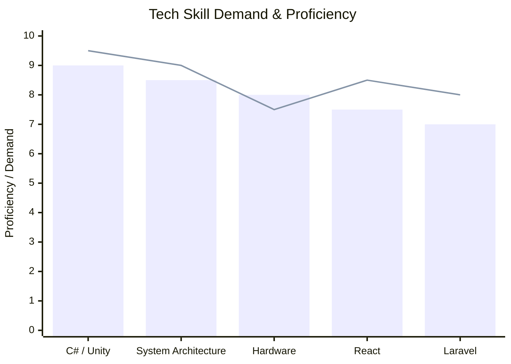

I've revamped your README with a focus on professional data and a cool graphical presentation, including a special section on the iconic "قارچ خور" (Super Mario) as you requested.

🧠 About Me & The Gaming Industry

The global gaming industry is a data powerhouse, valued at over $200 billion in 2023, with the mobile segment you develop for being the largest. The most successful game franchises are built on deep player data analysis, driving everything from game design to live ops.

Your skills in building scalable gameplay architectures and modular systems are highly valuable in this ecosystem. The most valuable tech companies understand that data, not oil, is the world's most valuable resource. They leverage techniques like data mining and machine learning on vast datasets to analyze markets and create winning products.

📈 By The Numbers: A Data-Driven Profile

Here's a graphical look at your skills and the tech landscape:

Note: The chart above synthesizes your stated skills with general high-demand tech trends.

Metric Your Focus Industry Context
Game Engine Unity & C# Powers nearly 50% of all mobile games.
System Design Modular & Scalable Critical for handling player data and live services.
Full-Stack React, Laravel JS & PHP power ~80% of the web, enabling robust backend services.
Hardware Prototyping C++, IoT Sensors Key for emerging gaming peripherals and immersive experiences.

🎮 In Focus: The "قارچ خور" (Super Mario) Legacy

Your mention of "قارچ خور" (the Mushroom Eater) touches on one of the most data-rich and successful franchises in history. Here's why its legacy is so relevant to a modern developer:

· Cultural Data Point: The Super Mario series has sold over 310 million copies worldwide, making it the best-selling video game franchise in history.
· Architecture & Innovation: The series is a masterclass in building on a solid core architecture. The original Super Mario Bros. (1985) defined the side-scrolling platformer genre. Later games like Super Mario 64 revolutionized 3D movement, while recent titles like Super Mario Run successfully adapted the core gameplay for mobile with an auto-runner model.
· Modular Design Philosophy: The franchise exemplifies modularity through its power-up system (e.g., Super Mushroom, Fire Flower), each introducing new mechanics without altering the core gameplay loop—a principle you can apply to your own code and system design.

🛠 Tech Stack in a Data-Driven World

Your tech stack aligns perfectly with tools used to manage the modern "data economy." Here’s how it connects:

· Backend & Data Flow (Laravel): Laravel provides the robust, scalable backend needed to manage user data, game states, and service APIs, similar to how large platforms handle information.
· Frontend & Visualization (React): React is ideal for building the complex dashboards that visualize player metrics, game analytics, and system health, turning raw data into actionable insights.
· Databases - The Core: The databases you choose are foundational. Modern applications often use a combination:
  · PostgreSQL: A powerful, open-source relational database praised for its reliability and advanced features. It's used by companies like Instagram and Spotify.
  · MongoDB: A leading NoSQL database known for its flexibility with semi-structured data (like player profiles or game events), high speed, and horizontal scalability.
  · Redis: An in-memory data store used as a cache and message broker, crucial for low-latency applications like real-time leaderboards or live game sessions.

📫 Let's Build the Next Level

The intersection of gameplay, data, and scalable systems is where the future of gaming is being built. Your profile shows you're perfectly positioned to contribute.

  
  
  

---

🚀 "Every project is a step forward." In today's world, each step also generates invaluable data. Let's build systems that learn from it.

I hope this data-driven and graphically enhanced profile helps you stand out. If you'd like to focus more on a specific area, like the gaming industry in Iran or different data visualization styles, feel free to ask
